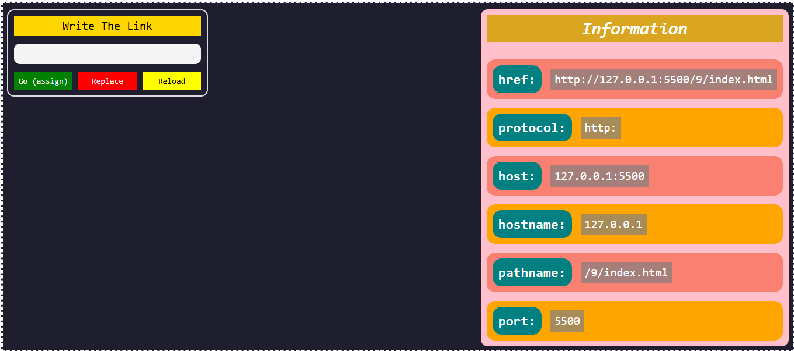

# 🌍 Smart Redirect & Location Info

A simple web project built with **HTML, CSS, and JavaScript** to demonstrate how to use the **Location Object** in the browser.

---

## 🚀 Features

- 🔗 Navigate to any URL using:
  - `location.assign()`
  - `location.replace()`
  - `location.reload()`

- 📊 Display current page information:
  - `href`
  - `protocol`
  - `host`
  - `hostname`
  - `pathname`
  - `port`

---

## 🧠 What I Learned

- Working with the **BOM (Browser Object Model)**
- Understanding the **Location Object**
- DOM Manipulation
- Handling user input
- Navigation between pages using JavaScript

---

## 📸 Preview

---

## 🛠️ Technologies Used

- HTML5
- CSS3
- JavaScript (Vanilla JS)

---

## 💻 Live Demo

[Click Here](https://omart-hub.github.io/smart-redirect-location-js/)

---

## 📌 How to Use

1. Enter a website name (e.g. `google` or `google.com`)
2. Click:
   - **Go** → to navigate normally
   - **Replace** → to navigate without going back
   - **Reload** → to refresh the page
3. View detailed information about the current URL

---

## 📁 Project Structure
